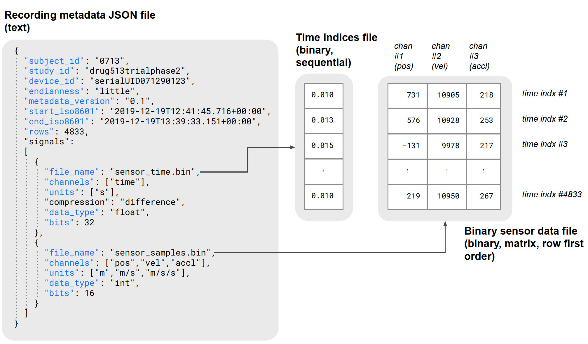

# Summary

The `tsdf` package[^1] is a comprehensively documented[^2] reference implementation of the Time Series Data Format (TSDF) standard [@claes2022tsdf]. TSDF simplifies data storage and exchange of multi-channel digital sensor data, thereby promoting interpretability and reproducibility of scientific results. Sensor measurements and timestamps are stored as raw tabular binary array files. To ensure unambiguous reconstruction, binary array files are accompanied by human-readable JavaScript Object Notation (JSON) metadata files, which contain a set of mandatory fields limited to essential sensor measurement information. This is illustrated in Figure 1.

The `tsdf` Python package implements functions for reading and writing TSDF files. It guarantees formatting and metadata consistency. It enforces usage of the essential metadata such as study identification, time frame, data channel descriptions and data attributes corresponding to the binary data. It also includes a convenient Matlab wrapper [@tsdf4mat].

*Figure 1: A schematic overview illustrating the contents of and relation between metadata and binary data in the TSDF format.*

# Statement of need

Digital sensors are being used to monitor health and disease at an increasingly large scale, resulting in large amounts of high-frequency, multi-channel time series data [@coravos2019developing]. To facilitate efficient data storage and re-use, the TSDF standard was proposed as an open, unified format for storing numerical types of digital sensor data (i.e. particular data with high temporal resolution). Here, we present the `tsdf` Python package, a public reference implementation of the TSDF standard, to facilitate its adoption by the scientific community. The `tsdf` package has already been used to facilitate large-scale data analysis of the Personalized Parkinson Project, a cohort study of 513 people with Parkinson's disease, which includes the continuous collection of multi-channel raw sensor data from a wrist-worn device, for 2 up to 3 years [@bloem2019personalized].

There are many approaches to store time series data as files. Simply storing the data as binary blocks leaves the user with too much freedom for interpretation, partly due to lacking a metadata structure. On the other end of the spectrum, textual formats like Comma-separated values (CSV) or JSON are too inefficient on space. A detailed comparison between common formats is made in the paper specifying the TSDF format [@claes2022tsdf].

For both basic binary files and textual formats, libraries to read and write are readily available. For data formats that support metadata, specialized implementations exist, where the complexity of the format is reflected in the implementation.
One example that stands out is Protocol Buffers[^3], Google's format for binary data structures. It is limited by a certain level of overhead: it requires specification of the data structure beforehand, compiling it into dedicated code that is highly performant. Any changes however, such as additional data channels, require recompiling the code, which is then incompatible with previously written files. Our approach is flexible enough to allow this.
Other alternatives, such as the NetCDF[^4] format, have well-developed libraries available in various programming languages.

With the TSDF package we provide a reference implementation that was not available for this format before. Although the TSDF standard is to a large extent self-explanatory, and basic read/write functionality is straightforward to implement, we believe that a stable, documented and flexible reference implementation is beneficial for a number of reasons. Implementing common functionality in a package increases readability, reduces redundancy by preventing repeated code, while simultaneously reducing the chance of errors in an implementation by researchers who might not be proficient in coding. In short, it will facilitate the adoption of the format and thus contribute to reproducibility in science.

# Features

For loading numerical data (i.e. sensor measurements and associated timestamps), the `tsdf` package interacts with the NumPy [@harris2020array] and Pandas [@reback2020pandas] libraries.

A dedicated data structure, `TSDFMetadata` manages the metadata file's structure to load or save binary data directly from/to NumPy arrays and Pandas DataFrames. To save resources, the data can be randomly accessed by loading only a selection of rows.

The flexibility in the metadata structure allows data of different modalities and different time scales to be combined. Appending a new data channel is easily done by appending it to the metadata, which will refer to the new binary file.

The library ensures that alterations made to the loaded data, such as a new data type after processing, are automatically reflected in the updated metadata file upon saving. Additionally, saved metadata is optimized to minimize redundancy: it makes use of the hierarchical JSON structure to maximize sharing of common fields.

And finally, the library can be used as a validator, both from code and as a command line tool, to check the compliance of existing data with the TSDF standard.

# Acknowledgements

This work was supported by the Netherlands eScience Center under grant number ASDI.2020.060 and by the Michael J Fox Foundation (grant #MJFF.020425). 

# References

<!-- Footnotes -->
[^1]: [https://pypi.org/project/tsdf/](https://pypi.org/project/tsdf/)
[^2]: [https://biomarkersparkinson.github.io/tsdf/](https://biomarkersparkinson.github.io/tsdf/)
[^3]: [https://protobuf.dev/](https://protobuf.dev/)
[^4]: [https://www.unidata.ucar.edu/software/netcdf/](https://www.unidata.ucar.edu/software/netcdf/)
